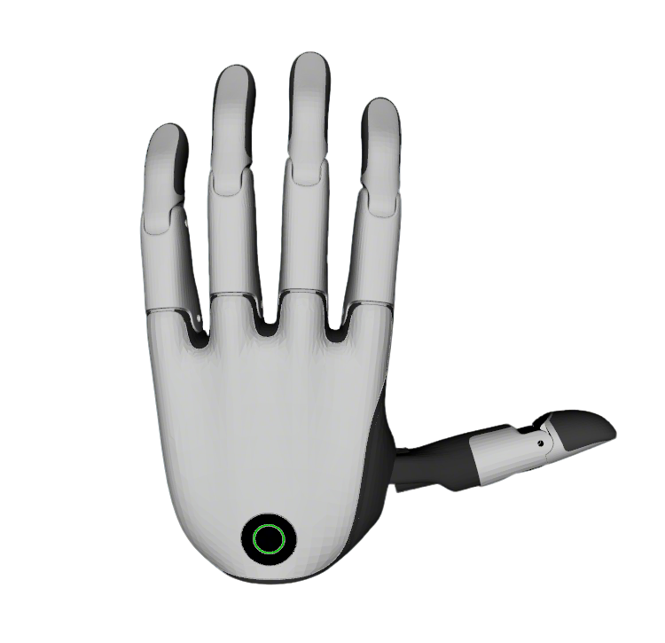
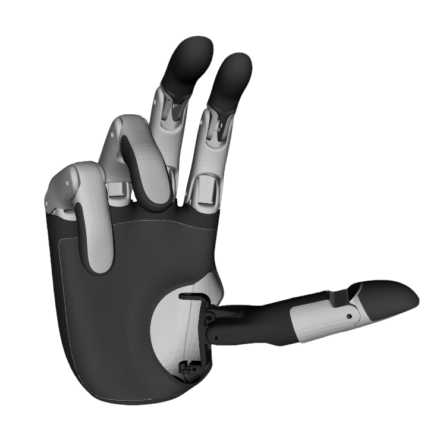

# BrainCo DexHands Description

This package contains the URDF and related files for the Brainco DexHands. Origin files could be found at [BrainCo](https://www.brainco.cn/#/product/revo2).

## Build

```bash
cd ~/ros2_ws
colcon build --packages-up-to brainco_description --symlink-install
```

## Visualize the DexHands

### Revo2 DexHands
* Left Hand
  ```bash
  # left hand
  source ~/ros2_ws/install/setup.bash
  ros2 launch robot_visualize_config hand.launch.py hand:=brainco direction:=1
  ```
  
    
* Right Hand
  ```bash
  # right hand
  source ~/ros2_ws/install/setup.bash
  ros2 launch robot_visualize_config hand.launch.py hand:=brainco direction:=-1
  ```
  