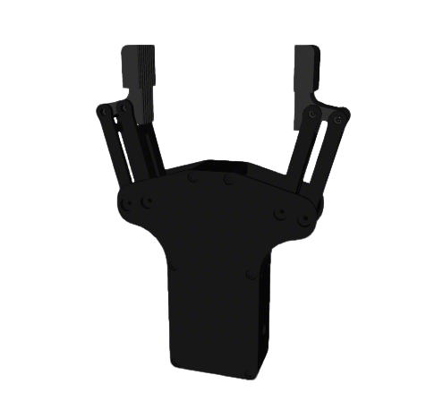

# Inspire Description

This package contains the URDF and related files for the Inspire Grippers.

## Build

```bash
cd ~/ros2_ws
colcon build --packages-up-to inspire_description --symlink-install
```

## Visualize the Gripper

* EG2-4C2
  ```bash
  source ~/ros2_ws/install/setup.bash
  ros2 launch robot_common_launch gripper.launch.py gripper:=inspire
  ```

  