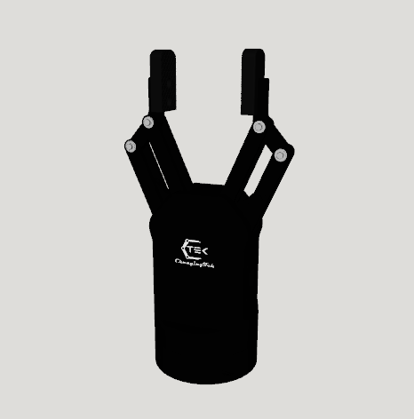
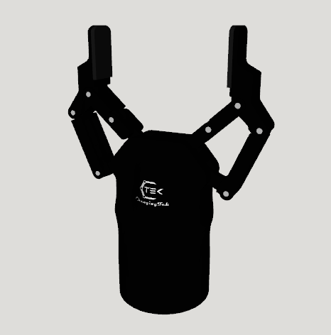

# ChangingTek Gripper Description

This package contains the URDF and related files for the ChangingTek Grippers. Origin files could be found at [ChangingTek](https://gitee.com/Ice_Panda/changingtek).

## Build

```bash
cd ~/ros2_ws
colcon build --packages-up-to changingtek_description --symlink-install
```

## Visualize the Gripper

* AG2F90-C Gripper
    ```bash
    source ~/ros2_ws/install/setup.bash
    ros2 launch robot_visualize_config gripper.launch.py gripper:=changingtek
    ```

  
* AG2F120S Gripper
    ```bash
    source ~/ros2_ws/install/setup.bash
    ros2 launch robot_visualize_config gripper.launch.py gripper:=changingtek type:=AG2F120S
    ```
  