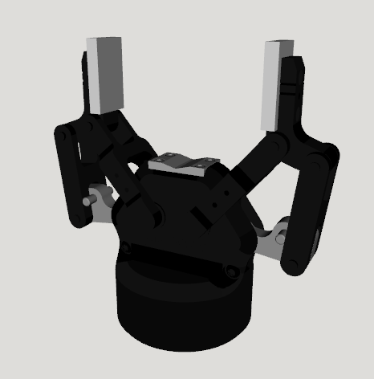

# Robotiq Gripper Description

This package contains the URDF and related files for the Robotiq 85 Gripper.

## Build

```bash
cd ~/ros2_ws
colcon build --packages-up-to robotiq_description --symlink-install
```

## Visualize the Gripper

* Robotiq 85 Gripper
  ```bash
  source ~/ros2_ws/install/setup.bash
  ros2 launch robot_visualize_config gripper.launch.py gripper:=robotiq
  ```

  