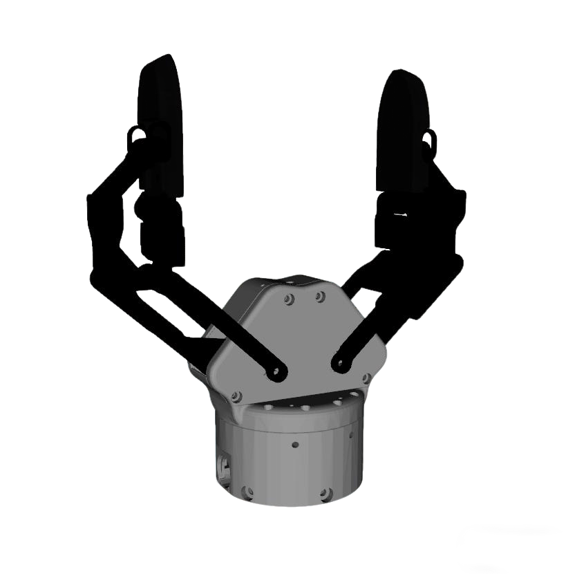
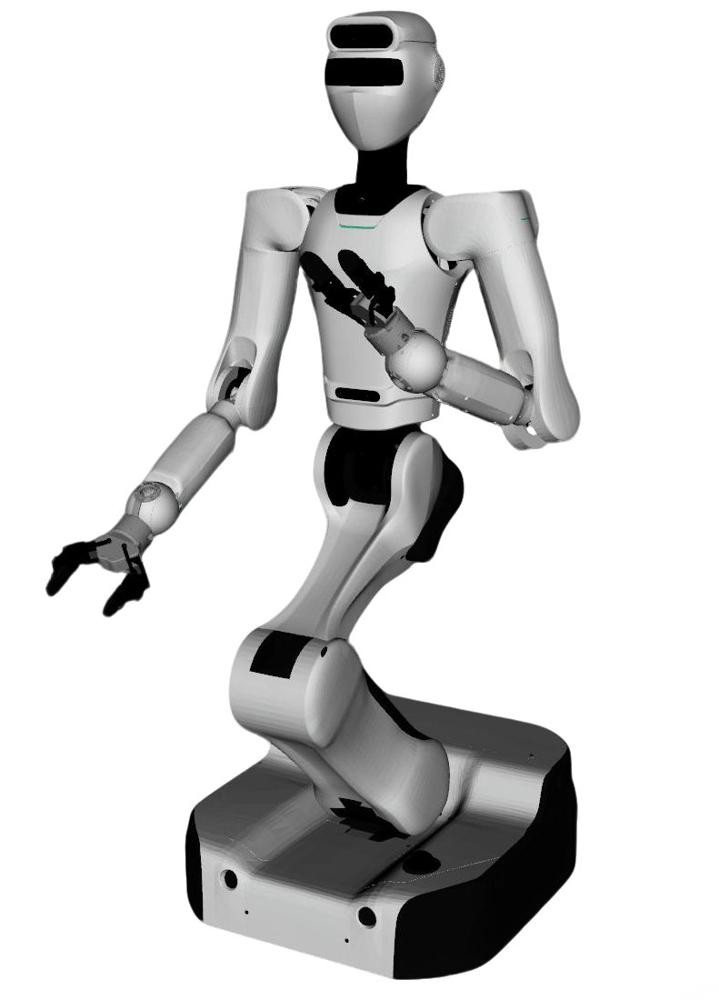

# Astribot S1 Description

This package contains the description files for Astribot S1 humanoid. The origin models could be found at [Astribot Description](https://github.com/Astribot-Dev/astribot_descriptions).

## 1. Build
```bash
cd ~/ros2_ws
colcon build --packages-up-to astribot_s1_description --symlink-install
```

## 2. Visualize the robot

* Gripper
  ```bash
  source ~/ros2_ws/install/setup.bash
  ros2 launch robot_common_launch gripper.launch.py gripper:=astribot_s1
  ```
  
* Robot with gripper
  ```bash
  source ~/ros2_ws/install/setup.bash
  ros2 launch robot_common_launch manipulator.launch.py robot:=astribot_s1
  ```
  
* Robot with BrainCo Revo2 hand
  ```bash
  source ~/ros2_ws/install/setup.bash
  ros2 launch robot_common_launch manipulator.launch.py robot:=astribot_s1 type:=revo2
  ```
  

## 3. OCS2 Demo

### 3.1 Official OCS2 Mobile Manipulator Demo

```bash
source ~/ros2_ws/install/setup.bash
ros2 launch robot_common_launch manipulator_ocs2.launch.py robot_name:=astribot_s1
```