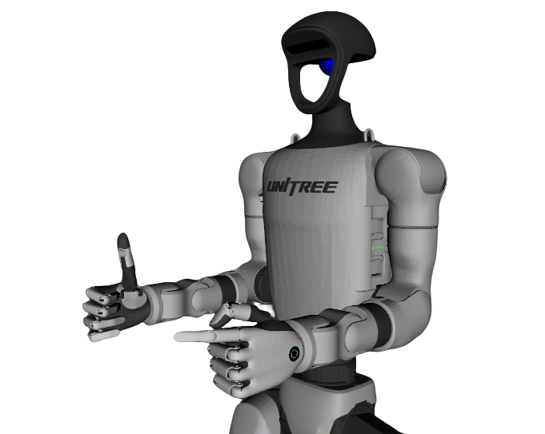

# Unitree G1 Description

This package contains the URDF and configuration files for the Unitree G1 humanoid. The origin models could be found at [unitree ros](https://github.com/unitreerobotics/unitree_ros).

## Build

```bash
cd ~/ros2_ws
colcon build --packages-up-to unitree_g1_description --symlink-install
```

## Visualize the robot

* G1 with rubber hand
  ```bash
  source ~/ros2_ws/install/setup.bash
  ros2 launch robot_visualize_config humanoid.launch.py
  ```
  

* G1 with BrainCo Revo2
  ```bash
  source ~/ros2_ws/install/setup.bash
  ros2 launch robot_visualize_config humanoid.launch.py end_effector:=revo2
  ```
  

## 3. OCS2 Demo

### 3.1 Official OCS2 Mobile Manipulator Demo

```bash
source ~/ros2_ws/install/setup.bash
ros2 launch robot_visualize_config manipulator_ocs2.launch.py robot_name:=unitree_g1
```
[Screencast from 2025-09-02 17-39-02.webm](https://github.com/user-attachments/assets/034081ec-9e49-46a3-9a85-3c422ed5e40c)
