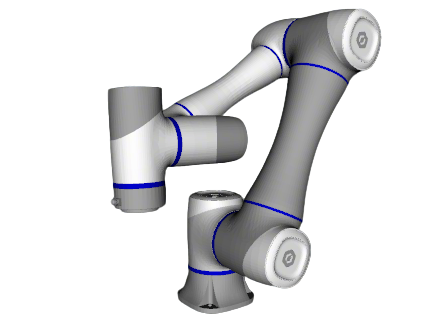
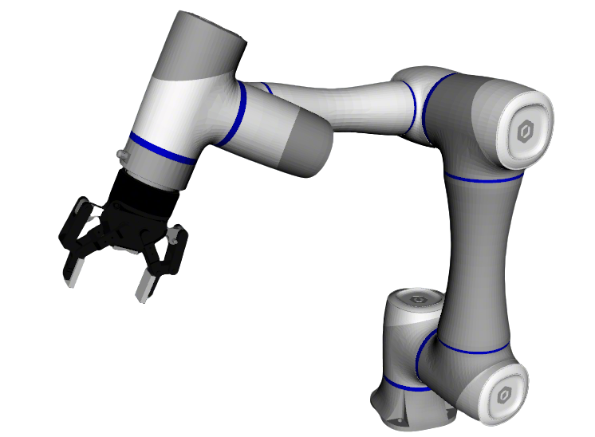
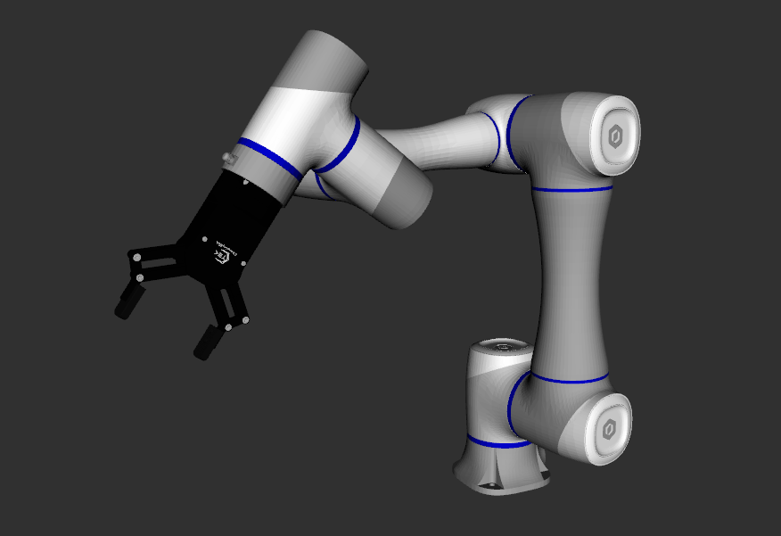

# Dobot CR5 Description

This package contains the description files for Dobot CR5 Manipulator. The origin models could be found at [DOBOT_6Axis_ROS2_V4](https://github.com/Dobot-Arm/DOBOT_6Axis_ROS2_V4).

## 1. Build
```bash
cd ~/ros2_ws
colcon build --packages-up-to cr5_description --symlink-install
```

## 2. Visualize the robot

* Without gripper
    ```bash
    source ~/ros2_ws/install/setup.bash
    ros2 launch robot_visualize_config manipulator.launch.py robot:=cr5
    ```
    ```bash
    source ~/ros2_ws/install/setup.bash
    ros2 launch robot_visualize_config manipulator.launch.py robot:=cr5 collider:=simple
    ```
    

* With Robotiq 85 Gripper
    ```bash
    source ~/ros2_ws/install/setup.bash
    ros2 launch robot_visualize_config manipulator.launch.py robot:=cr5 type:="robotiq85"
    ```
  

* With ChangingTek AG2F90-C Gripper
    ```bash
    source ~/ros2_ws/install/setup.bash
    ros2 launch robot_visualize_config manipulator.launch.py robot:=cr5 type:="AG2F90-C"
    ```
  

## 3. OCS2 Demo
### 3.1 Official OCS2 Mobile Manipulator Demo
```bash
source ~/ros2_ws/install/setup.bash
ros2 launch robot_visualize_config manipulator_ocs2.launch.py robot_name:=cr5
```


### 3.2 OCS2 Arm Controller Demo

* Gazebo
  ```bash
  source ~/ros2_ws/install/setup.bash
  ros2 launch ocs2_arm_controller demo.launch.py hardware:=gz type:=AG2F90-C
  ```
  ```bash
  source ~/ros2_ws/install/setup.bash
  ros2 launch ocs2_arm_controller demo.launch.py hardware:=gz
  ```
* Isaac Sim
  ```bash
  source ~/ros2_ws/install/setup.bash
  ros2 launch ocs2_arm_controller demo.launch.py hardware:=isaac type:=AG2F90-C
  ```
* Real Robot
  ```bash
  source ~/ros2_ws/install/setup.bash
  ros2 launch ocs2_arm_controller demo.launch.py hardware:=real type:=empty
  ```