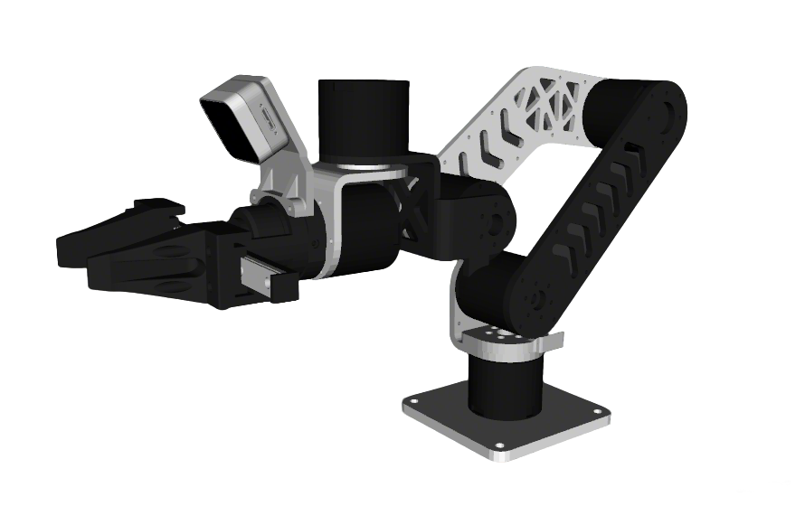

# Panthera Description

This package contains the description files for Panthera Manipulator. The origin models could be found at [Panthera](https://github.com/Ragtime-LAB/Ragtime_Panthera).

## 1. Build
```bash
cd ~/ros2_ws
colcon build --packages-up-to panthera_description --symlink-install
```

## 2. Visualize the robot

To visualize and check the configuration of the robot in rviz, simply launch:

* Single Arm
  ```bash
  source ~/ros2_ws/install/setup.bash
  ros2 launch robot_visualize_config manipulator.launch.py robot:=panthera
  ```
* With D405
  ```bash
  source ~/ros2_ws/install/setup.bash
  ros2 launch robot_visualize_config manipulator.launch.py robot:=panthera type:=d405
  ```

  

## 3. OCS2 Demo

### 3.1 Official OCS2 Mobile Manipulator Demo

```bash
source ~/ros2_ws/install/setup.bash
ros2 launch robot_visualize_config manipulator_ocs2.launch.py robot_name:=panthera
```

### 3.2 OCS2 Arm Controller Demo

```bash
source ~/ros2_ws/install/setup.bash
ros2 launch ocs2_arm_controller demo.launch.py robot:=panthera hardware:=gz
```