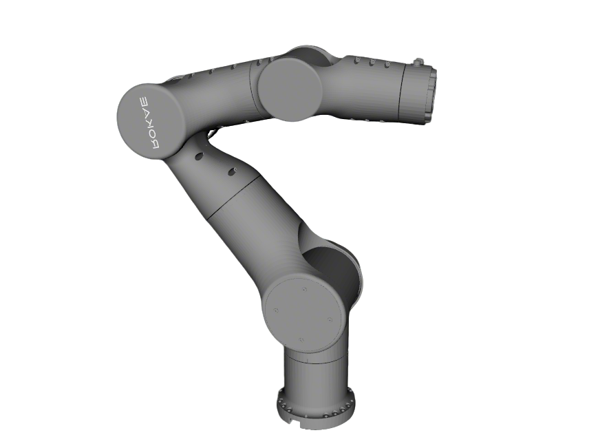

# Rokae AR5 Description

This package contains the description files for Rokae AR5 Manipulator.

## 1. Build

```bash
cd ~/ros2_ws
colcon build --packages-up-to rokae_ar5_description --symlink-install
```

## 2. Visualize the robot

* Left Arm
    ```bash
    source ~/ros2_ws/install/setup.bash
    ros2 launch robot_common_launch manipulator.launch.py robot:=rokae_ar5
    ```
  
* Right Arm
    ```bash
    source ~/ros2_ws/install/setup.bash
    ros2 launch robot_common_launch manipulator.launch.py robot:=rokae_ar5 type:=right
    ```
  

## 3. OCS2 Demo

### 3.1 Official OCS2 Mobile Manipulator Demo

* Left Arm
  ```bash
  source ~/ros2_ws/install/setup.bash
  ros2 launch robot_common_launch manipulator_ocs2.launch.py robot_name:=rokae_ar5
  ```
* Right Arm
  ```bash
  source ~/ros2_ws/install/setup.bash
  ros2 launch robot_common_launch manipulator_ocs2.launch.py robot_name:=rokae_ar5 type:=right
  ```

### 3.2 OCS2 Arm Controller Demo

* Mock Components
  ```bash
  # Left Arm
  source ~/ros2_ws/install/setup.bash
  ros2 launch ocs2_arm_controller demo.launch.py robot:=rokae_ar5 
  ```
    ```bash
  # Right Arm
  source ~/ros2_ws/install/setup.bash
  ros2 launch ocs2_arm_controller demo.launch.py robot:=rokae_ar5 type:=right
  ```

* Gazebo
  ```bash
  # Left Arm
  source ~/ros2_ws/install/setup.bash
  ros2 launch ocs2_arm_controller demo.launch.py robot:=rokae_ar5 hardware:=gz
  ```
    ```bash
  # Right Arm
  source ~/ros2_ws/install/setup.bash
  ros2 launch ocs2_arm_controller demo.launch.py robot:=rokae_ar5 hardware:=gz type:=right
  ```

## 4. Real Robot Deploy

* Single Left Arm
  ```bash
  source ~/ros2_ws/install/setup.bash
  ros2 launch ocs2_arm_controller demo.launch.py robot:=rokae_ar5 hardware:=real
  ```